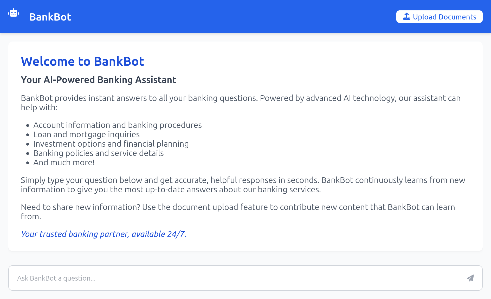
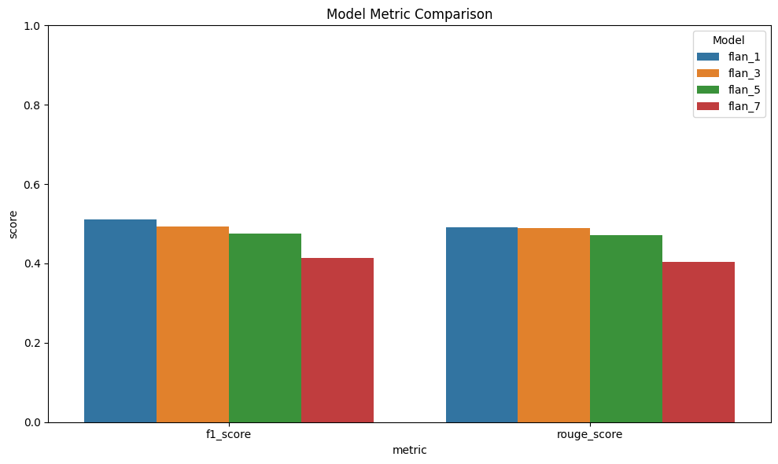
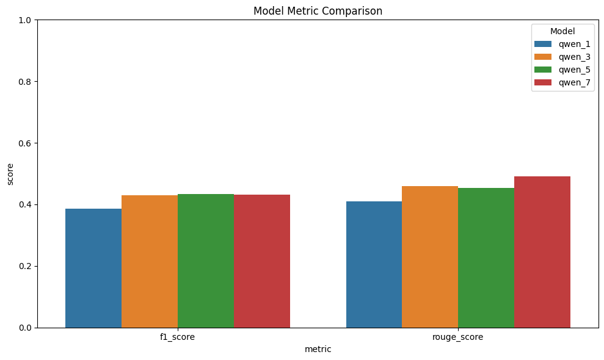

# NUST Bank Chatbot

This is our LLM course project at NUST, where the goal was to build a chatbot for a fictional bank using large language models. The idea was to turn a dataset of anonymized customer queries and product info into something useful—basically, an AI assistant that can answer customer questions reliably and stay within privacy boundaries.

We used a retrieval-augmented generation (RAG) setup. The documents (Excel and JSON) were parsed, cleaned, chunked, and embedded using all-MiniLM-L6-v2. For fast similarity search, we used FAISS. Then we tested a few small models like Flan-T5 and Qwen (all under 1B params) so everything could run on a local CPU without needing a GPU.

The chatbot is fully customizable through a config class. You can switch models, change chunk sizes, update documents on the fly, and even run a web interface. We also tried basic fine-tuning on Flan-T5-Large with our dataset, and did some benchmarking to compare models and top\_k retrieval settings.

The main motivation was to explore how LLMs can be applied in a real-world customer service setting, especially with limited compute.

## Usage

Install dependencies:

```bash
pip install -r requirements.txt
```

### Quick Start

Basic inference:

```python
from chatbot import ChatbotConfig, Chatbot

config = ChatbotConfig()
chatbot = Chatbot(config)

answer, meta = chatbot.query("How much loan can I avail?")
```

### Customization

Configure the chatbot:

```python
from chatbot import ChatbotConfig, Chatbot

config = ChatbotConfig(
	# Choose your model
	chatbot_model_name="google/flan-t5-large",
	# chatbot_model_name="google/flan-t5-base",
	# chatbot_model_name="Qwen/Qwen3-0.6B",
	# chatbot_model_name="Qwen/Qwen2.5-0.5B",

	# Data sources
	excel_data_path="data/NUST Bank-Product-Knowledge.xlsx",
	json_data_path="data/funds_transfer_app_features_faq (1).json",

	# Embedding settings
	embedding_model_name="all-MiniLM-L6-v2",
	top_k=3,
	chunk_size=80,
	overlap=20,

	# Caching and output
	output_dir="temp/",
	use_cache=True,

	# Optional reasoning (if supported)
	enable_thinking=False,

	# Device preference: 'auto', 'cpu', 'cuda', etc.
	device="cpu",
)
chatbot = Chatbot(config)
answer, meta = chatbot.query("What is PWRA?")

prompt = meta["prompt"]
relevant_docs = meta["relevant_docs"]
relevant_docs_scores = meta["relevant_docs_scores"]
```

### Adding Documents

Add custom documents at runtime:

```python
from chatbot import ChatbotConfig, Chatbot

config = ChatbotConfig(chunk_size=50, overlap=10)
chatbot = Chatbot(config)

new_doc = """
NUST Bank is a leading financial institution founded in 2003, headquartered in Islamabad,
Pakistan. With over 80 branches nationwide, it offers a full range of banking services
including retail banking, corporate financing, digital banking, and investment advisory.
Key Highlights:
- Name: NUST Bank Ltd.
- Tagline: "Innovating Finance, Empowering Futures"
- CEO: Zara Qureshi
- Employees: 2,500+
- Assets: PKR 180 billion (as of 2024)
- Core Services: Savings & Current Accounts, Home & Auto Loans, SME Financing, Mobile Banking, and Digital Wallet
- Digital App: NUSTPay (supports bill payments, QR payments, fund transfers, and biometric login)
- Innovation: Launched Pakistan’s first AI-powered customer service chatbot in 2022
- Regulation: Licensed and regulated by the State Bank of Pakistan
NUST Bank is known for its student-focused products, given its origins from the NUST
community, and has a reputation for fast adoption of tech in financial services.
"""
chatbot.add_document(new_doc)

question = "What is NUST Bank about?"
answer, meta = chatbot.query(question)
relevant_docs = meta["relevant_docs"]
```

### Batch Processing

Run multiple queries:

```python
from chatbot import ChatbotConfig, Chatbot

config = ChatbotConfig()
chatbot = Chatbot(config)

questions = [
	"How do I delete my mobile banking account?",
	"What does PWRA stand for?",
	"What is NSA?",
	"What are the available Liability Products & Services?",
	"What is the profit rate for PWRA?",
]
answers = chatbot.multiple_queries(questions)
```

### Web Interface

Run the web interface using
```cmd
python app.py
```



## Features

### Data Ingestion & Preprocessing

* We use [prepare\_excel\_data.py](prepare_excel_data.py) and [prepare\_json\_data.py](prepare_json_data.py) to parse raw data from the [data/](data/) directory.

  ```bash
  python prepare_excel_data.py --path "data/NUST Bank-Product-Knowledge.xlsx" --output "processed_data/excel_output.json" --verbose
  python prepare_json_data.py --path "data/funds_transfer_app_features_faq (1).json" --output "processed_data/json_output.json" --verbose
  ```
* Parsed entries are cleaned and converted into documents by combining category info (e.g. sheet name or section heading) with the corresponding question and answer.
* Each document is chunked using the configured `chunk_size` and `overlap`.
* If caching is enabled, processed documents and their embeddings are saved to `output_dir`.

### Language Model Selection

* We focused on LLMs under 1B parameters to ensure compatibility with local CPU (16GB RAM).
* The following models were evaluated (see [Benchmarking](#benchmarking) for results):

  * [Qwen2.5-0.5B-Instruct](https://huggingface.co/Qwen/Qwen2.5-0.5B-Instruct)
  * [Qwen3-0.6B](https://huggingface.co/Qwen/Qwen3-0.6B)
  * [Flan-T5-Base](https://huggingface.co/google/flan-t5-base)
  * [Flan-T5-Large](https://huggingface.co/google/flan-t5-large)

### Embedding & Indexing

* Embeddings are generated using `all-MiniLM-L6-v2` from SentenceTransformers.
* We use FAISS (`IndexFlatIP`) for efficient similarity search using inner product.
* The FAISS index is cached (`index.faiss`) for fast reloads.

### Model Fine-Tuning

* We fine-tuned `flan-t5-large` on our domain-specific data. See [notebooks/](notebooks/) for the process and results.

### Prompt Engineering

* Prompts include structured behavioral and safety instructions.
* When supported, chat-style prompting is used (`apply_chat_template`).
* Retrieved documents are inserted into the prompt context before querying.

### Real-Time Updates

* You can dynamically add documents via the "Add Documents" button in the [web app](#web-interface) or programmatically with `add_document()`.
* The document is parsed, chunked based on config, and added to the vector store instantly.

### Performance & Reliability

* Supports batch querying through `multiple_queries()`.
* Optimized for local inference using smaller models for speed and memory efficiency.
* Highly configurable for different models, embedding methods, and settings.

### Guardrails

* Basic prompt-level guardrails are applied to prevent prompt injection and keep model outputs aligned with the intended task.

## Benchmarking

* We manually curated test samples from both the Excel and JSON datasets to evaluate pipeline performance.
* Experiments were run by varying `top_k` (number of retrieved documents used as context) and testing across different pre-trained models.
* We used F1 score and ROUGE score as evaluation metrics.
* Find code at [notebooks/](notebooks/)



**Flan models** performed better with fewer documents in context. This is likely because Flan excels at accurately extracting and repeating relevant information directly from the prompt.



**Qwen models** showed improved performance with more documents in context. They tend to generalize better, rephrasing information in a more human-like, conversational style.


| Model Name         | Hugging Face Link                                           | Downloads   | Size (Params) |
|--------------------|-------------------------------------------------------------|-------------|---------------|
| Qwen2.5-0.5B       | [Qwen2.5-0.5B-Instruct](https://huggingface.co/Qwen/Qwen2.5-0.5B-Instruct) | 872,268     | 494M          |
| Qwen3-0.6B         | [Qwen3-0.6B](https://huggingface.co/Qwen/Qwen3-0.6B)         | 454,331     | 752M          |
| Flan-T5 Base       | [flan-t5-base](https://huggingface.co/google/flan-t5-base)  | 2,946,006   | 248M          |
| Flan-T5 Large      | [flan-t5-large](https://huggingface.co/google/flan-t5-large)| 482,761     | 783M          |

When comparing models using **ROUGE score** (our more reliable metric), **Flan-T5-Large** and **Qwen3 (0.6B)** emerged as the top performers. We use these models interchangeably in the final pipeline, depending on use case and resource availability.
